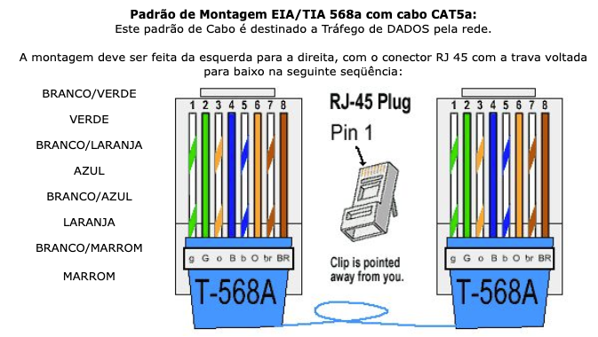
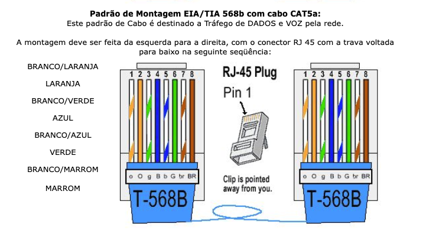
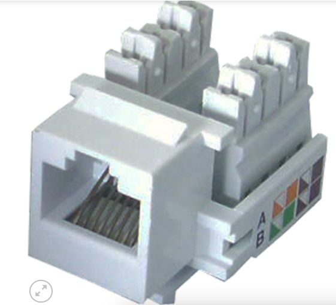
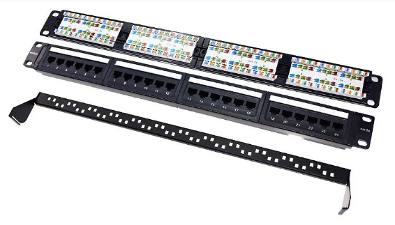
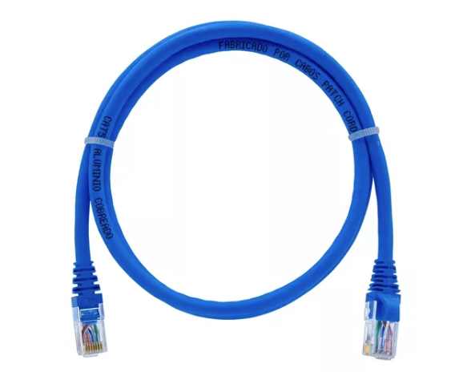

Identificação | Keystones | Patch Panel | Ferramentas
---

> Ferramentas para conectores do tipo Key Stone

Nas aulas anteriores utilizamos alicates de climpar, para conectores do tipo rj45.
Utilizamos decapadores do próprio alicate de climpar, para cortar, decapar, e alinhar os fios que devem ser utilizados nas devidas sequências conforme padrões estabelecidos T-568A

ou T-568B

Keystone
---

##Agora conheceremos o keystone, o conector utilizado na parede para conexão de patch cords.

> Pesquise sobre as finalidades e usos de keystones em projetos de rede, principalmente em redes estruturadas e fale sobre esse tipo de projeto e sobre certificação de pontos de rede.

Patch Panels
---

.

> Pesquise sobre as finalidades e usos patch panel em projetos de rede, principalmente em redes estruturadas e fale sobre esse tipo de projeto e sobre certificação de pontos de rede.

Patch cord
---

.

> Pesquise sobre as finalidades e usos patch cord em projetos de rede, principalmente em redes estruturadas e fale sobre esse tipo de projeto e sobre certificação de pontos de rede.

Uso do alicate PUNCH DOWN
---

assista o video no youtube e conheça mais a respeito da ferramenta.

https://www.youtube.com/watch?v=7V9BkkH18WA

Por fim
---

>Porém não menos importante, realize uma pesquise sobre a recomendação de evitar a passagem dos cabos de dados junto com a passagem de cabos elétricos.

Agora "Mão na massa"
---
Dividiremos as equipes em pares, onde seremos responsáveis por organizar o cabeamento dos laboratórios.

Enquanto os pares realizam a atividade, os demais irão de forma conceitual compreender o uso das ferramentas e cada item listado acima.

As identificações devem ser anotadas no quadro branco, e ao fim iremos fazer um documento mapeando cada ponto de dado que foi organizado e testado. 